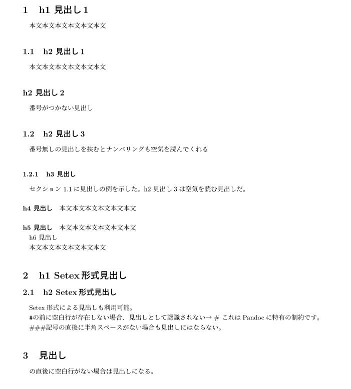
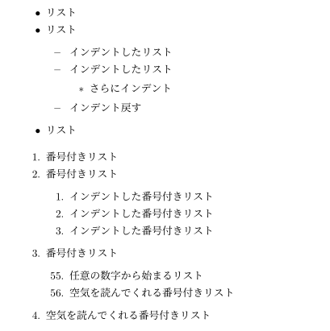
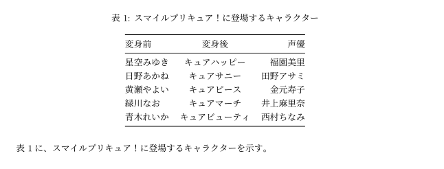
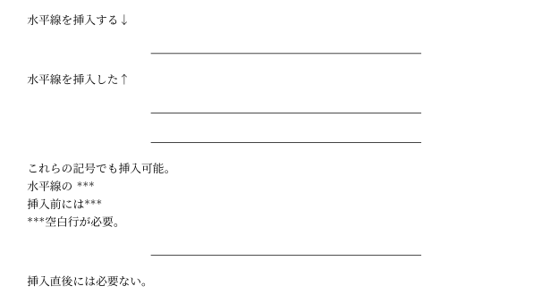
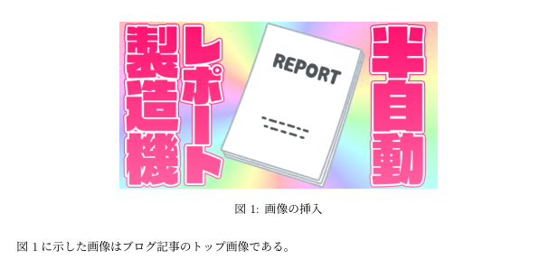
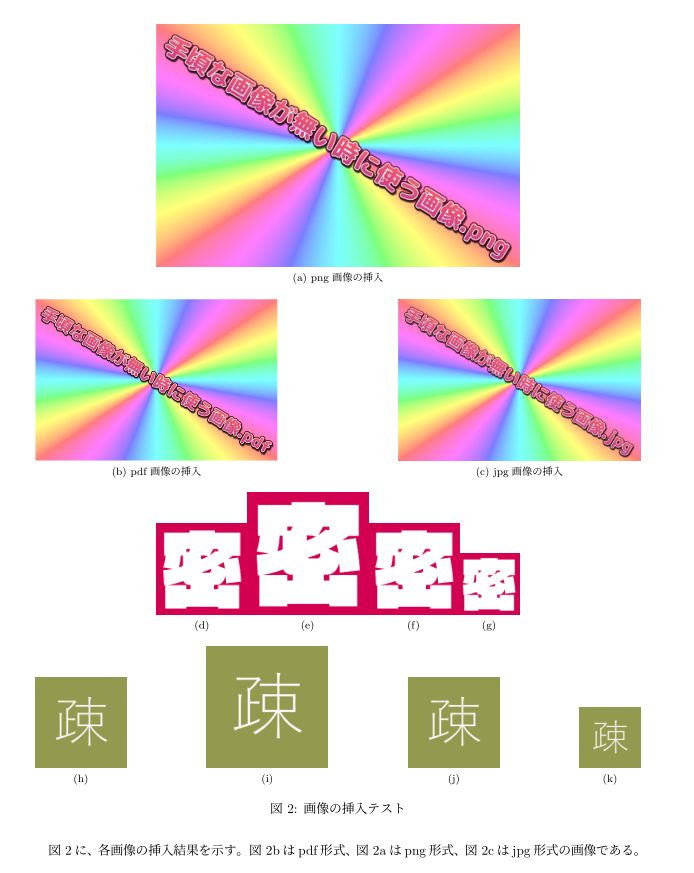

# Markdown2PDF

1. `report.md`を編集して
2. `references.bib`を編集して
3. 使用画像を`./src/img`に入れて
4. `build.bat`を実行すると
5. PDFが出来ます

## 必要な物

- Pandoc <https://pandoc.org/installing.html>
- pandoc-crossref <https://github.com/lierdakil/pandoc-crossref>
- LaTeX
  - uplatex
  - dvipdfmx
  - biber
  - Latexmk

## Markdown形式とLaTeX コマンドの対応

<https://pandoc.org/MANUAL.html#Pandoc%E2%80%99s%20Markdown>を読むとより理解が深まると思います。

---

### 本文

```.md
ここは本文です。適当な文章が思いつかない。

空白行を挟むと別の段落になります。普通に一度改行しても改行されません(ここに改行→)
文末に2つの半角スペースを挿入した場合、その時点で改行されますが段落は変わりません(ここに2つの半角スペース→)  
本文の途中に半角スペースを1つ挿入すると→ ←無視されます。本文の途中に半角スペースを複数挿入しても→    ←無視されます。全角スペースを挿入した場合は→　　　　←ちゃんと空きます。
```

↓Pandocで変換

```.tex
ここは本文です。適当な文章が思いつかない。

空白行を挟むと別の段落になります。普通に一度改行しても改行されません(ここに改行→)
文末に2つの半角スペースを挿入した場合、その時点で改行されますが段落は変わりません(ここに2つの半角スペース→)\\
本文の途中に半角スペースを1つ挿入すると→
←無視されます。本文の途中に半角スペースを複数挿入しても→
←無視されます。全角スペースを挿入した場合は→　　　　←ちゃんと空きます。
```

Pandocによる日本語Markdown文書の変換時の改行・空白についてはこちらで詳しく説明されています:<https://qiita.com/zr_tex8r/items/5a62804ca493b77e793c>

---

### 見出し

```.md
# h1 見出し1

本文本文本文本文本文本文

## h2 見出し1 {#sec:h2_1}

本文本文本文本文本文本文

## h2 見出し2 {-}

番号がつかない見出し

## h2 見出し3

番号無しの見出しを挟むとナンバリングも空気を読んでくれる

### h3 見出し

[@sec:h2_1]に見出しの例を示した。[h2 見出し3]は空気を読む見出しだ。

#### h4 見出し

本文本文本文本文本文本文

##### h5 見出し

本文本文本文本文本文本文

###### h6 見出し

本文本文本文本文本文本文

h1 Setex形式見出し
==========

h2 Setex形式見出し
------------

Setex形式による見出しも利用可能。

`#`の前に空白行が存在しない場合、見出しとして認識されない→
# これはPandocに特有の制約です。

###記号の直後に半角スペースがない場合も見出しにはならない。

# 見出し
の直後に空白行がない場合は見出しになる。
```

↓Pandocで変換

```.tex
\hypertarget{h1-ux898bux51faux30571}{%
\section{h1 見出し1}\label{h1-ux898bux51faux30571}}

本文本文本文本文本文本文

\hypertarget{sec:h2_1}{%
\subsection{h2 見出し1}\label{sec:h2_1}}

本文本文本文本文本文本文

\hypertarget{h2-ux898bux51faux30572}{%
\subsection*{h2 見出し2}\label{h2-ux898bux51faux30572}}
\addcontentsline{toc}{subsection}{h2 見出し2}

番号がつかない見出し

\hypertarget{h2-ux898bux51faux30573}{%
\subsection{h2 見出し3}\label{h2-ux898bux51faux30573}}

番号無しの見出しを挟むとナンバリングも空気を読んでくれる

\hypertarget{h3-ux898bux51faux3057}{%
\subsubsection{h3 見出し}\label{h3-ux898bux51faux3057}}

セクション~\ref{sec:h2_1}に見出しの例を示した。\protect\hyperlink{h2-ux898bux51faux30573}{h2
見出し3}は空気を読む見出しだ。

\hypertarget{h4-ux898bux51faux3057}{%
\paragraph{h4 見出し}\label{h4-ux898bux51faux3057}}

本文本文本文本文本文本文

\hypertarget{h5-ux898bux51faux3057}{%
\subparagraph{h5 見出し}\label{h5-ux898bux51faux3057}}

本文本文本文本文本文本文

h6 見出し

本文本文本文本文本文本文

\hypertarget{h1-setexux5f62ux5f0fux898bux51faux3057}{%
\section{h1
Setex形式見出し}\label{h1-setexux5f62ux5f0fux898bux51faux3057}}

\hypertarget{h2-setexux5f62ux5f0fux898bux51faux3057}{%
\subsection{h2
Setex形式見出し}\label{h2-setexux5f62ux5f0fux898bux51faux3057}}

Setex形式による見出しも利用可能。

\texttt{\#}の前に空白行が存在しない場合、見出しとして認識されない→ \#
これはPandocに特有の制約です。

\#\#\#記号の直後に半角スペースがない場合も見出しにはならない。

\hypertarget{ux898bux51faux3057}{%
\section{見出し}\label{ux898bux51faux3057}}

の直後に空白行がない場合は見出しになる。
```



見出しのトップレベルは変換時のオプション`--top-level-division={{トップレベル}}`で変更可能。上の例は`section`にしている。`part`, `chapter`, `section`, `default`が利用可能。

この例では`h1`から順に
1. `\section{}`
2. `\subsection{}`
3. `\subsubsection{}`
4. `\paragraph{}`
5. `\subparagraph{}`

となっている。`h6`はレベル6の見出しと認識されているが、\LaTeX に対応するコマンドが足りなくなったので文章として扱われている。(その為`######`は消えている)
pandoc-crossrefを利用していれば`{#sec:hoge}`のようにしてラベルを与えることができ、`[@sec:hoge]`で相互参照できる。
`{-}`あるいは`{.unnumbered}`を末尾に加えると`\section*{hoge}`が使われることでナンバリングされなくなる。同時に`\addcontentsline{toc}{section}{hoge}`も挿入されるため、目次から消えることはない。
自動で`\hypertarget{}`が付与されるので`[{{見出し文}}]`と文中に挿入するとリンクになる。

---

### 装飾

```.md
Markdownなら*斜体の文字*、\LaTeX なら*下線付き文字*になる。Pandocでは`_`を用いた強調は_使用できない_。

**これは太文字**

~~取り消し線~~

[You can also use small caps.]{.smallcaps}
```

↓Pandocで変換

```.tex
Markdownなら\emph{斜体の文字}、\LaTeX なら\emph{下線付き文字}になる。Pandocでは\texttt{\_}を用いた強調は\_使用できない\_。

\textbf{これは太文字}

\sout{取り消し線}

\textsc{You can also use small caps.}
```


---

### リンク

```.md
明示したリンク <https://trap.jp/post/1123/>

[タイトル付きのリンク](https://trap.jp/post/1123/ "タイトル")

自動リンク https://trap.jp/post/1123/
```

↓Pandocで変換

```.tex
明示したリンク \url{https://trap.jp/post/1123/}
\href{https://trap.jp/post/1123/}{タイトル付きのリンク}
自動リンク https://trap.jp/post/1123/
```


リンクは`<>`で囲んで上げないと認識されない。

---

### 引用

```.md
ここは本文です。

> これは引用文です。
>> Markdownなら引用のネストができるけど \LaTeX ではできません。

ここも本文です。
```

↓Pandocで変換

```.tex
\begin{quote}
これは引用文です \textgreater{} 引用のネストも可能
\textgreater\textgreater{} さらなるネストもできます
\end{quote}
```


引用は`quote`が使用されるが、引用のネストには対応していない。

---

### リスト

```.md
- リスト
- リスト
    - インデントしたリスト
    - インデントしたリスト
        - さらにインデント
    - インデント戻す
- リスト

1. 番号付きリスト
2. 番号付きリスト
    1. インデントした番号付きリスト
    2. インデントした番号付きリスト
    3. インデントした番号付きリスト
3. 番号付きリスト
    55. 任意の数字から始まるリスト
    301. 空気を読んでくれる番号付きリスト
99. 空気を読んでくれる番号付きリスト
```

↓Pandocで変換

```.tex
\begin{itemize}
\tightlist
\item
  リスト
\item
  リスト

  \begin{itemize}
  \tightlist
  \item
    インデントしたリスト
  \item
    インデントしたリスト

    \begin{itemize}
    \tightlist
    \item
      さらにインデント
    \end{itemize}
  \item
    インデント戻す
  \end{itemize}
\item
  リスト
\end{itemize}

\begin{enumerate}
\def\labelenumi{\arabic{enumi}.}
\tightlist
\item
  番号付きリスト
\item
  番号付きリスト

  \begin{enumerate}
  \def\labelenumii{\arabic{enumii}.}
  \tightlist
  \item
    インデントした番号付きリスト
  \item
    インデントした番号付きリスト
  \item
    インデントした番号付きリスト
  \end{enumerate}
\item
  番号付きリスト

  \begin{enumerate}
  \def\labelenumii{\arabic{enumii}.}
  \setcounter{enumii}{54}
  \tightlist
  \item
    任意の数字から始まるリスト
  \item
    空気を読んでくれる番号付きリスト
  \end{enumerate}
\item
  空気を読んでくれる番号付きリスト
\end{enumerate}
```



リストを挿入すると`\tightlist`というコマンドが使われる。が、これは\LaTeX には存在しないので適当なところで定義してあげる必要がある。私は`template.tex`で

```
\def\tightlist{\itemsep1pt\parskip0pt\parsep0pt}
```

と定義している。(参考:<https://qiita.com/Selene-Misso/items/6c27a4a0947f10af3119>)

---

### 表

```.md
| 変身前     | 変身後           | 声優       |
| :--------- | :--------------: | ---------: |
| 星空みゆき | キュアハッピー   | 福園美里   |
| 日野あかね | キュアサニー     | 田野アサミ |
| 黄瀬やよい | キュアピース     | 金元寿子   |
| 緑川なお   | キュアマーチ     | 井上麻里奈 |
| 青木れいか | キュアビューティ | 西村ちなみ |
: スマイルプリキュア！に登場するキャラクター {#tbl:precure}

[@tbl:precure]に、スマイルプリキュア！に登場するキャラクターを示す。
```

↓Pandocで変換

```.tex
\hypertarget{tbl:precure}{}
\begin{longtable}[]{@{}lcr@{}}
\caption{\label{tbl:precure}スマイルプリキュア！に登場するキャラクター}\tabularnewline
\toprule
変身前 & 変身後 & 声優\tabularnewline
\midrule
\endfirsthead
\toprule
変身前 & 変身後 & 声優\tabularnewline
\midrule
\endhead
星空みゆき & キュアハッピー & 福園美里\tabularnewline
日野あかね & キュアサニー & 田野アサミ\tabularnewline
黄瀬やよい & キュアピース & 金元寿子\tabularnewline
緑川なお & キュアマーチ & 井上麻里奈\tabularnewline
青木れいか & キュアビューティ & 西村ちなみ\tabularnewline
\bottomrule
\end{longtable}

表~\ref{tbl:precure}に、スマイルプリキュア！に登場するキャラクターを示す。
```



Pandocによる表の変換では`longtable`が使われる。Markdownで`:キャプション`のようにコロンで始まる行(あるいは`Table:`で始まる行)を追加することでキャプションをつけることができる。
pandoc-crossrefを利用していれば`{#tbl:hoge}`のように書くことで`[@tbl:hoge]`で相互参照が可能。

pipe table、grid tableの他にもsimple tableという形式が使えたり、multiline tableで行の分割ができたりする。詳しくは<https://pandoc.org/MANUAL.html#Tables>を確認してください。

---

### 水平線

```.md
水平線を挿入する↓

---

水平線を挿入した↑

_ _ _

***

これらの記号でも挿入可能。

水平線の
***

挿入前には***

***空白行が必要。

***
挿入直後には必要ない。
```

↓Pandocで変換

```.tex
水平線を挿入する↓

\begin{center}\rule{0.5\linewidth}{0.5pt}\end{center}

水平線を挿入した↑

\begin{center}\rule{0.5\linewidth}{0.5pt}\end{center}

\begin{center}\rule{0.5\linewidth}{0.5pt}\end{center}

これらの記号でも挿入可能。

\hypertarget{ux6c34ux5e73ux7ddaux306eux633fux5165ux524dux5f8cux306bux306f}

{#fig:pdf width=40%}\hfill
{#fig:jpg width=40%}

{width=15%}
{#fig:mitsu width=20%}
{width=15%}
{width=10%}

{width=15%}\hfill
{width=20%}\hfill
{width=15%}\hfill
{width=10%}

画像の挿入テスト
</div>

[@fig:narabi]に、各画像の挿入結果を示す。[@fig:pdf]はpdf形式、[@fig:png]はpng形式、[@fig:jpg]はjpg形式の画像である。
```

↓Pandocで変換

```.tex
\begin{figure}
\hypertarget{fig:post_image}{%
\centering
\includegraphics{./img/post_image.png}
\caption{画像の挿入}\label{fig:post_image}
}
\end{figure}

図~\ref{fig:post_image}に示した画像はブログ記事のトップ画像である。

\begin{figure}
\centering

\subfloat[png画像の挿入]{\includegraphics[width=0.6\textwidth,height=\textheight]{./img/sample_image.png}\label{fig:png}}

\subfloat[pdf画像の挿入]{\includegraphics[width=0.4\textwidth,height=\textheight]{./img/sample_image.pdf}\label{fig:pdf}}\hfill
\subfloat[jpg画像の挿入]{\includegraphics[width=0.4\textwidth,height=\textheight]{./img/sample_image.jpg}\label{fig:jpg}}

\subfloat[]{\includegraphics[width=0.15\textwidth,height=\textheight]{./img/mitsu.png}}
\subfloat[]{\includegraphics[width=0.2\textwidth,height=\textheight]{./img/mitsu.png}}
\subfloat[]{\includegraphics[width=0.15\textwidth,height=\textheight]{./img/mitsu.png}}
\subfloat[]{\includegraphics[width=0.1\textwidth,height=\textheight]{./img/mitsu.png}}

\subfloat[]{\includegraphics[width=0.15\textwidth,height=\textheight]{./img/so.png}}\hfill
\subfloat[]{\includegraphics[width=0.2\textwidth,height=\textheight]{./img/so.png}}\hfill
\subfloat[]{\includegraphics[width=0.15\textwidth,height=\textheight]{./img/so.png}}\hfill
\subfloat[]{\includegraphics[width=0.1\textwidth,height=\textheight]{./img/so.png}}

\caption{画像の挿入テスト}

\label{fig:narabi}

\end{figure}

図~\ref{fig:narabi}に、各画像挿入結果を示す。
```



通常のMarkdown同様に画像の挿入ができる。上に示したフォーマット以外ではepsなども挿入できる。挿入行の末尾に`{width=50%}`と書けば本文横幅の50%の大きさで挿入される(縦横比を保つために<https://github.com/detteiu8383/Markdown2PDF/blob/d3957576c6f298a215e00839336d5ec1164e40f2/src/templates/template.tex#L37>の記述が必要)。



`<div>...</div>`で囲うと`\subfloat[]{}`によって下端揃えで並べられる。具体的な書き方は何となくわかってほしい。サイズ指定を行って横幅合計100%以下になるようにしよう。デフォルトでは中央に隙間なく寄せられてしまうのでLaTeX の`\hfill`コマンドで等間隔にスペースを開けるといい感じ。

pandoc-crossrefを利用していれば`{#fig:hoge}`でラベル付け、`[@fig:hoge]`で相互参照が可能。横ならべ時は`<div id="{{hoge}}">`で画像群全体のラベル付け。`<div>...</div>`内の各画像に対してもラベル付け・参照可能。

---

### 脚注

```.md
脚注も利用することができる[^footnote_sample]。

[^footnote_sample]:このように脚注が表示される。

真中らぁらはプリパラ外では雨宮くん[^amamiya]より伸長が低いが、プリパラ内ではらぁらの背の方が高くなる。

雨宮くん\footnotemark[2]は南みれぃよりも背が低く、立ち振る舞いからも後輩であると勘違いしがちだが、普通にみれぃと同級生である。

[^amamiya]:本名は雨宮春希であるが、アニメで初めてフルネームが出されたのは132話(の提供でやってたしりとり)である。
```

↓Pandocで変換

```.tex
脚注も利用することができる\footnote{このように脚注が表示される。}。

真中らぁらはプリパラ外では雨宮くん\footnote{本名は雨宮春希であるが、アニメで初めてフルネームが出されたのは132話(の提供でやってたしりとり)である。}より伸長が低いが、プリパラ内ではらぁらの背の方が高くなる。

雨宮くん\footnotemark[2]は南みれぃよりも背が低く、立ち振る舞いからも後輩であると勘違いしがちだが、普通にみれぃと同級生である。
```


通常のMarkdownの脚注機能が使える。上の例で複数箇所に`[^amamiya]`と記述しても1つの脚注にリンクはせず、同内容の脚注が何個も書かれてしまうため、複数個所で同内容を参照したい場合はLaTeXコマンドの`\footnotemark[{{番号}}]`を用いる。

### その他便利なコマンド

基本的には LaTeX コマンドをMarkdown中に記述すればLaTeX コマンドとして受け付けてくれるので、

- `\clearpage`、`\newpage`による改ページ
- `\multicolumn`を利用した表の挿入(Markdownの表と互換性が無いので表全体を手打ちすることになる)
- `\tableofcontents`による目次の挿入

等も行うことができる。
